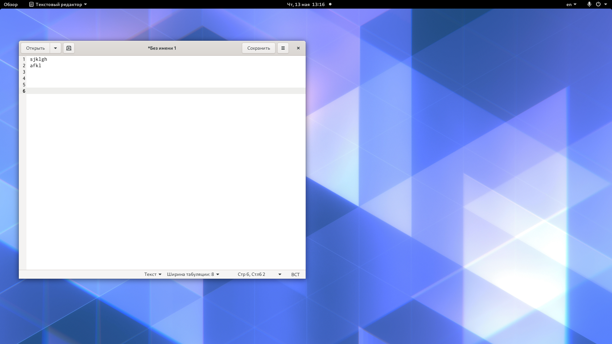

---
# Front matter
lang: ru-RU
title: "Отчёт по лабораторной работе №4"
subtitle: "Знакомство с операционной системой Linux"
author: "Николаев Дмитрий Иванович"

# Formatting
toc-title: "Содержание"
toc: true # Table of contents
toc_depth: 2
fontsize: 12pt
linestretch: 1.5
papersize: a4paper
documentclass: scrreprt
polyglossia-lang: russian
polyglossia-otherlangs: english
mainfont: PT Serif
romanfont: PT Serif
sansfont: PT Sans
monofont: PT Mono
mainfontoptions: Ligatures=TeX
romanfontoptions: Ligatures=TeX
sansfontoptions: Ligatures=TeX,Scale=MatchLowercase
monofontoptions: Scale=MatchLowercase
indent: true
pdf-engine: lualatex
header-includes:
  - \linepenalty=10 # the penalty added to the badness of each line within a paragraph (no associated penalty node) Increasing the value makes tex try to have fewer lines in the paragraph.
  - \interlinepenalty=0 # value of the penalty (node) added after each line of a paragraph.
  - \hyphenpenalty=50 # the penalty for line breaking at an automatically inserted hyphen
  - \exhyphenpenalty=50 # the penalty for line breaking at an explicit hyphen
  - \binoppenalty=700 # the penalty for breaking a line at a binary operator
  - \relpenalty=500 # the penalty for breaking a line at a relation
  - \clubpenalty=150 # extra penalty for breaking after first line of a paragraph
  - \widowpenalty=150 # extra penalty for breaking before last line of a paragraph
  - \displaywidowpenalty=50 # extra penalty for breaking before last line before a display math
  - \brokenpenalty=100 # extra penalty for page breaking after a hyphenated line
  - \predisplaypenalty=10000 # penalty for breaking before a display
  - \postdisplaypenalty=0 # penalty for breaking after a display
  - \floatingpenalty = 20000 # penalty for splitting an insertion (can only be split footnote in standard LaTeX)
  - \raggedbottom # or \flushbottom
  - \usepackage{float} # keep figures where there are in the text
  - \floatplacement{figure}{H} # keep figures where there are in the text
---

# Цель работы

Познакомиться с операционной системой Linux,получить практические навыки работы
с консолью и некоторыми графическими менеджерами рабочих столов операционной системы.

# Выполнение лабораторной работы

1) Ознакомился с теоритическим материалом.
2) Загрузил компьютер.
3) Перешёл на текстовую консоль, которая выглядит как текстовая консоль. На моём компьютере доступно 6 текстовых консолей.
4) Перемещение между текстовыми консолями осуществляется посредством комбинации клавиш ALT+(F1-F6).
5) Зарегистрировался в текстовой консоли со своим логином и паролем. При вводе пароля никакие символы не отображаются.
6) Завершить консольный сеанс можно с помощью сочетания клавиш ctrl+D или консольной команды logout.
7) Вернулся к графическому интерфейсу с помощью комбинации ctrl+Alt+F7.
8) Ознакомился с менеджером рабочих столов. Менеджер, запускаемый по умолчанию называется Классический GNOME
9) Поочерёдно зарегистрировался в разных графических менеджерах рабочих столов (GNOME, MATE, 
XfCe) и оконных менеджерах (Openbox). На моём рабочем компьютере установлены данные менеджеры, разнообразные 
версии GNOME и другие.

{ #fig:001 width=70% }
{ #fig:001 width=70% }
{ #fig:001 width=70% }
{ #fig:001 width=70% }

10) Изучил список установленных программ. Запустил поочерёдно браузер, текстовый редактор, текстовый процессор, эмулятор консоли.
Браузер:
{ #fig:001 width=70% }
{ #fig:001 width=70% }
{ #fig:001 width=70% }
{ #fig:001 width=70% }
Текстовый редактор:
{ #fig:001 width=70% } - Текстовый редактор
{ #fig:001 width=70% } - Kwrite
{ #fig:001 width=70% } - KWrite 
{ #fig:001 width=70% } - KWrite
Текстовый процессор:
{ #fig:001 width=70% } - LibreOffice Writer
{ #fig:001 width=70% } - LibreOffice Writer
{ #fig:001 width=70% } - LibreOffice Writer
{ #fig:001 width=70% }
Эмулятор консоли:
{ #fig:001 width=70% }
{ #fig:001 width=70% }
{ #fig:001 width=70% }
{ #fig:001 width=70% }

## Контрольные вопросы:
***
1. Компьютерный терминал - это интерфейс, позволяющий пользователю взаимодействовать с компьютером и его устройствами.
Преимуществом является нетребовательность к составляющим компьютера, что позволяет работать на компьютерах и 
с минимальной конфигурацией, также исключаются различные баги. Недостатком же является более высокий 
порог вхождения, так как графическая консоль интуитивно понятнее.
2. Входное имя - Название учётной записи пользователя, что вводится при регистрации пользователя в системе.
3. Пароли хранятся в зашифрованном виде в скрытом файле /etc/shadow, который доступен только для чтения и только пользователем root.
4. Все настройки хранятся в конфигурационных файлах. Большинство файлов размещено в папке /etc/.
5. root.
6. Да, имеет.
7. Иерархия пользователей, зависящая от выданных прав. Пользователи имеют определённые ограничения 
на возможные действия: чтение, изменение, запуск файлов, также ограничевается пространство в 
файловой системе, процессорное время. Действия одного пользователя не влияют на работу другого.
8. User ID (UID), Group ID (GID), General Infotmation (GECOS), Домашний каталог (Home directory), указатель на версию shell.
9. User ID (UID) - внутренний (уникальный) идентификатор пользователя. Group ID (GID) - групповой идентификатор пользователя.
10. GECOS - поле учётной записи пользователя в файле /etc/passwd в системах UNIX. Оно создано для хранения различной информации пользователя (имя, фамилия, номер телефона и т.д.).
11. Домашний каталог - это директория в UNIX-подобных ОС, содержащая домашние директории пользователя. В них хранятся документы и настройки пользователя.
12. /home/dinikolaev.
13. Да, имеет право.
14. В нём хранятся данные об учётных записях пользователя.
15. Если в поле пароля будет стоять символ "*", то этот пользователь не сможет зайти в систему.
16. Виртуальные консоли - это представление многотерминальной работы в рамках одного устройства. В данном контексте, виртаульные - значит, что все работают с этим устройством.
17. Для управления различными консолями, как физическими, так и виртуальными (для UNIX-подобных ОС).
18. Сеанс - период работы учётной записи пользователя между авторизацией и завершением этого сеанса или, другими словами, процесс обмена информацией пользователя и компьютера до завершения сеанса.
19. Toolkit - кроссплатформенная библиотека базовых элементво графического интерфейса.
20. GTK, GTK+(GIMP Tollkit), GDK, Qt.

# Выводы

> Познакомился с ОС Linux, получил практические навыки работы с текстовой консолью и некторыми графическими менеджерами рабочих столов ОС. Произвёл оценку и сравнение разных графических сред Linux. Воспользовался виртуальной консолью.
