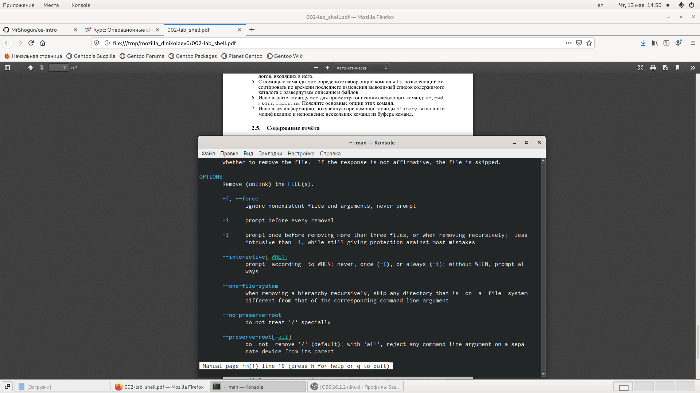

---
# Front matter
lang: ru-RU
title: "Отчёт по лабораторной работе №5"
subtitle: "Основы интерфейса взаимодействия пользователя с системой Unix на уровне командной строки"
author: "Николаев Дмитрий Иванович"

# Formatting
toc-title: "Содержание"
toc: true # Table of contents
toc_depth: 2
fontsize: 12pt
linestretch: 1.5
papersize: a4paper
documentclass: scrreprt
polyglossia-lang: russian
polyglossia-otherlangs: english
mainfont: PT Serif
romanfont: PT Serif
sansfont: PT Sans
monofont: PT Mono
mainfontoptions: Ligatures=TeX
romanfontoptions: Ligatures=TeX
sansfontoptions: Ligatures=TeX,Scale=MatchLowercase
monofontoptions: Scale=MatchLowercase
indent: true
pdf-engine: lualatex
header-includes:
  - \linepenalty=10 # the penalty added to the badness of each line within a paragraph (no associated penalty node) Increasing the value makes tex try to have fewer lines in the paragraph.
  - \interlinepenalty=0 # value of the penalty (node) added after each line of a paragraph.
  - \hyphenpenalty=50 # the penalty for line breaking at an automatically inserted hyphen
  - \exhyphenpenalty=50 # the penalty for line breaking at an explicit hyphen
  - \binoppenalty=700 # the penalty for breaking a line at a binary operator
  - \relpenalty=500 # the penalty for breaking a line at a relation
  - \clubpenalty=150 # extra penalty for breaking after first line of a paragraph
  - \widowpenalty=150 # extra penalty for breaking before last line of a paragraph
  - \displaywidowpenalty=50 # extra penalty for breaking before last line before a display math
  - \brokenpenalty=100 # extra penalty for page breaking after a hyphenated line
  - \predisplaypenalty=10000 # penalty for breaking before a display
  - \postdisplaypenalty=0 # penalty for breaking after a display
  - \floatingpenalty = 20000 # penalty for splitting an insertion (can only be split footnote in standard LaTeX)
  - \raggedbottom # or \flushbottom
  - \usepackage{float} # keep figures where there are in the text
  - \floatplacement{figure}{H} # keep figures where there are in the text
---

# Цель работы

Приобретение практических навыков взаимодействия пользователя с системой посредством командной строки.

# Выполнение лабораторной работы

1) Определил полное имя моего домашнего каталога, а именно /home/dinikolaev (с помощью команды pwd, находясь в домашней директории).
2) Перешёл в каталог /tmp и вывел его содержимое с помощью команды ls с различными опциями (см.скриншот 1, 2), где -a отображает имена скрытых файлов; -F отображает информацию о типах файлов; -l отображает подробную информацию о файлах и каталогах.

3) Проверил наличие подкаталога cron в каталоге /var/spool (перешёл в каталог spool с помощью cd и проверил его содержимое с помощью ls) {частично в скриншоте 4}.

4) Создал каталог newdir в домашнем каталоге с помощью команды mkdir и в нём же создал новый каталог morefun.

5) С помощью одной команды mkdir создал в домашнем каталоге 3 новых каталога с именами letters, memos, misk. После удалил их одной командой rmdir.
    а) Попробовал удалить каталог ~/newdir одной командой rm -> не удалился, так как каталог был не пустой (необходим флаг -r).
    б) Удалил каталог ~/newdir/morefun из домашнего каталога с помощью команды rmdir.

6) С помощью команды man определил опцию команды ls, необходимую для просмотра содержимого не только каталога, но и его подкаталогов -> Используется опция -R.

7) С помощью команды man определил опцию команды ls, позволяющую отсортировать выводимый список содержимого каталого по времени последнего изменения с развёрнутым описанием файлов -> Использовать опции -t для сортировки по времени изменения, -l для вывода развёрнутого описания файлов (уже использовалось выше); Опционально для вывода по времени последнего изменения в обратном порядке можно использовать опцию -r.

    а) Проверили сортировку по времени последнего изменения в домашнем каталоге (Была загрузка скриншотов в Изображения).

8) С помощью команды man просмотрел описание следующих команд: cd, pwd, mkdir, rmdir, rm.
    а) Команда cd имеет 2 основные опции: 
	1. -P позволяет следовать по ссылкам до обработки всех переходов в родительский каталог ("..");
	2. -L осуществляет переход по ссылкам только после обработки переходов в родительскую директорию.

    б) Команда pwd имеет следующие основные опции: 
	1. -L берёт директорию из переменной окружения, даже если она содержит символические ссылки; 
	2. -P отбрасывает все символические ссылки; 
	3. --help отображает справку по утилите; 
	4. --version отображает версию утилиты.

    в) Команда mkdir имеет следующие основные опции: 
	1. -m позволяет установить права доступа для создаваемой директории;
	2. -p создаёт все родительские директории, которые указаны внутри пути (если какая-то существует, то предупреждение не выводится);
	3. -v выводит сообщение о каждой создаваемой директории;
	4. -z устанавливает контекст SELinux для создаваемой директории в значении CTX;
	5. --help показывает справку по утилите;
	6. --version показывает версию утилиты.

    г) Команда rmdir имеет следующие основные опции:
	1. -ignore-fail-on-non-empty не сообщает об ошибке если каталог не пуст;
	2. -p удаляются все составляющии пути (если каталоги не пусты);
	3. -v отображает подробную информацию для каждого обрабатываемого каталога;
	4. --help показывает справку по утилите rmdir;
	5. --version показывает версию утилиты.

    д) Команда rm имеет следующие основные опции (Скриншот 13 и 14):
	1. -f игнорирует несуществующие файлы и аргументы (не выдавать запросы на подтверждение);
	2. -i выводит запрос на подтверждение после удаления каждого файла;
	3. -I выводит один запрос на подтверждение удаления всех файлов (если удаляется больше 3-ёх);
	4. --interactive[=КОГДА] выбор запрос на подтверждение (never-никогда не запрашивать, once-аналог -I, always-аналог -i;Если не задано, то используется always);
	5. --one-file-system пропускает директории, находящиеся на других файловых системах (во время рекурсивного удаления);
	6. --no-preserve-root если для удаления задан корневой раздел /, то считать его обычной директорией и выполнять удаление;
	7. --preserve-root НЕ (п.6). Используется по умолчанию;
	8. -r или -R удаляет директории и их содержимое (рекурсивное удаление);
	9. -d удаляет пустые директории;
	10. -v выводит информацию об удаляемых файлах;
	11. --help показывает справку по утилите rm;
	12. --version показывает версию утилиты.

9) Воспользовался командой history для просмотра истории использованных команд в данном консольном сеансе.

Выполнил модификацию и исполнение некторых команд (см.скриншоты 16, 17), пользуясь следующей конструкцией:
"!<Номер_команды>:s/<что_изменяем>/<на_что_меняем>".

## Контрольные вопросы
***
1. Командная строка - программная оболочка (shell), позволяющая в текстовом виде вводить различные команды.
2. При помощи команды pwd. Находясь в домашней директории моего персонального компьютера получишь вывод /home/dinikolaev.
3. При помощи команды ls и опции -F (если файлы скрыты то ещё нужна опция -a). Примеры см.выше в "Выполнение лабораторной работы".
4. Скрытые файлы обычно используются для настроек рабочей среды, имена таких файлов начинается с точки. Для того, чтобы отобразить имена скрытых файлов, нужно использовать команды ls с опцией -a. Примеры см.выше в "Выполнение лабораторной работы".
5. Команда rm используется для удаления как файлов, так и каталогов.
6. Команда history выводит список выполненных ранее в этом сеансе команд.
7. Можно модифицировать команду из списка выполненных команд (команда history) при помощи следующей конструкции: !<номер_команды>:s/<что_меняем>/<на_что_меняем>. Пример см.скриншот 16 и 17.
8. Да, можно. Нужно использовать символ ";". Например cd; ls.
9. Замена управляющих (специальных) символов (".", "/", "*" и т.д.) осуществляется с помощью символа экранирования, а именно символа "\". Другими словами, с помощью "\" можно записать текст с использованием управляющих символов. Например чтобы вывести "/bin", нужно написать "\/bin" (для вывода самого символа экранирования нужно ввести "\\").
10. Выводится тип файла, право доступа, число ссылок, владелец, размер, дата последней ревизии, имя файла или каталога.
11. Относительный путь - путь из текущего рабочего каталога, абсолютный же путь - полный путь к файлу (или директории). Например, находясь в домашней директории: cd var - относительный путь; cd /home/dinikolaev/var - абсолютный путь.
12. Воспользоваться командой man.
13. Клавиша tab служит для автоматического дополнения вводимых команд.

# Выводы

> Приобрёл практические навыки взаимодействия пользователя с системой посредством командной строки. Закрепил использование наиболее распространённых команд и узнал больше возможностей их использования.
