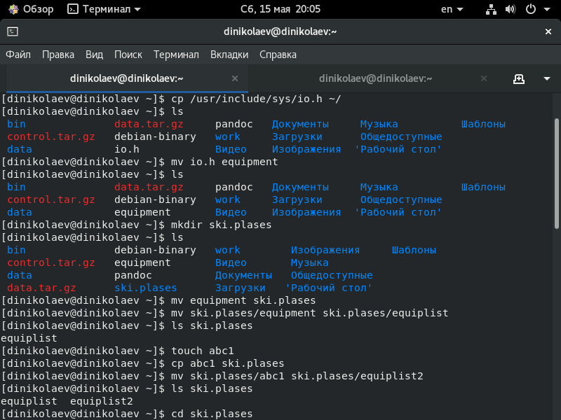

---
# Front matter
lang: ru-RU
title: "Отчёт по лабораторной работе №6"
subtitle: "Анализ файловой системы Linux. Команды для работы с файлами и каталогами"
author: "Николаев Дмитрий Иванович"

# Formatting
toc-title: "Содержание"
toc: true # Table of contents
toc_depth: 2
fontsize: 12pt
linestretch: 1.5
papersize: a4paper
documentclass: scrreprt
polyglossia-lang: russian
polyglossia-otherlangs: english
mainfont: PT Serif
romanfont: PT Serif
sansfont: PT Sans
monofont: PT Mono
mainfontoptions: Ligatures=TeX
romanfontoptions: Ligatures=TeX
sansfontoptions: Ligatures=TeX,Scale=MatchLowercase
monofontoptions: Scale=MatchLowercase
indent: true
pdf-engine: lualatex
header-includes:
  - \linepenalty=10 # the penalty added to the badness of each line within a paragraph (no associated penalty node) Increasing the value makes tex try to have fewer lines in the paragraph.
  - \interlinepenalty=0 # value of the penalty (node) added after each line of a paragraph.
  - \hyphenpenalty=50 # the penalty for line breaking at an automatically inserted hyphen
  - \exhyphenpenalty=50 # the penalty for line breaking at an explicit hyphen
  - \binoppenalty=700 # the penalty for breaking a line at a binary operator
  - \relpenalty=500 # the penalty for breaking a line at a relation
  - \clubpenalty=150 # extra penalty for breaking after first line of a paragraph
  - \widowpenalty=150 # extra penalty for breaking before last line of a paragraph
  - \displaywidowpenalty=50 # extra penalty for breaking before last line before a display math
  - \brokenpenalty=100 # extra penalty for page breaking after a hyphenated line
  - \predisplaypenalty=10000 # penalty for breaking before a display
  - \postdisplaypenalty=0 # penalty for breaking after a display
  - \floatingpenalty = 20000 # penalty for splitting an insertion (can only be split footnote in standard LaTeX)
  - \raggedbottom # or \flushbottom
  - \usepackage{float} # keep figures where there are in the text
  - \floatplacement{figure}{H} # keep figures where there are in the text
---

# Цель работы

Ознакомление с файловой системой Linux, её структурой, именами и содержанием каталогов. Приобретение практических навыков по применению команд для работы с файлами и каталогами, по управлению процессами (и работами), по проверке использования диска и обслуживанию файловой системы.

# Выполнение лабораторной работы

1) Выполнил следующие действия; все наименования относительно домашней директории: (см.скриншоты 1 и 2)
    - Скопировал файл (команда "cp") /usr/include/sys/io.h в домашний каталог и переименовал в equipment.
    - В домашнем каталоге создал директорию ("mkdir") ski.plases.
    - Переместил файл ("mv") equipment в каталог ski.plases.
    - Переименовал файл ("mv") ski.plases/equipment в ski.plases/equiplist.
    - Создал в домашнем каталоге файл ("touch") abc1 и скопировал его в каталог ski.plases, после переименовал его в equiplist2.
    - Создал каталог equipment в каталоге ski.plases.
    - Переместил файлы ski.plases/equiplist и ski.plases/equiplist2 в каталог ski.plases/equipment.
    - Создал и переместил каталог newdir в каталог ski.plases и переименовал его в plans.
    - Создал каталоги australia и play и файлы my_os и feathers (для выполнения следующего пункта).

2) Определил необходимые опции команды chmod, необходимые для присвоения каталогам australia (drwxr--r--) и play (drwx--x--x) и файлам my_os (-r-xr--r--) и feathers (-rw-rw-r--) выделенные права доступа, считая что в начале таких прав нет.

3) Проделал приведённые ниже упражнения; все наименования относительно домашней директории:

    - Просмотрел содержимое файла /etc/passwd (команда "cat").

    - Скопировал файл ("cp") feathers в файл file.old (предварительно создав его)-> файл в файл не копируется, так что feathers остался в домашней директории.
    - Переместил файл ("mv") file.old в каталог play.
    - Скопировал каталог ("cp") play в каталог fun (предварительно создав его).
    - Переместил каталог ("mv") fun в каталог play и переименовал ("mv") его в games.
    - Лишил владельца (u) файла feathers права на чтение ("chmod u-r").
    - Попытавшись просмотреть файл с помощью команды cat, вывода не получим, так как в прошлом пункте лишились этих прав.
    - Попытавшись скопировать файл ("cp"), копирование не произойдёт, так как копирование входит в права чтения (которых лишились).

    - Вернул владельцу (u) файла feathers право на чтение ("chmod u+r").
    - Лишил владельца (u) каталога play права на выполнение ("chmod u-x").
    - Попытавшись перейти в каталог ("cd") play, ничего не произошло, так как переход в каталог входит в права на выполнение (x), которых лишились в прошлом пункте.
    - Вернул владельцу (u) каталога play права на выполнение ("chmod u+x").

4) Прочитал man по командам mount, fsck, mkfs, kill:

    - Команда mount позволяет просмотреть используемые в операционной системе файловые системы.

    - Команда fsck позволяет проверить, а иногда и восстановить целостность файловой системы.

    - Команда mkfs позволяет создавать различные файловые системы Linux

    - Команда kill позволяет "убивать" (т.е. посылать сигнал завершения процесса, тип вызываемого сигнала зависит от опций команды kill) различные процессы.

5) Рассмотрим примеры использования представленных выше команд (fsck и mkfs выполняются под рутом):

Команда mount

Команда fsck

Команда mkfs

Команда kill

## Контрольные вопросы
***
1. На моём компьютере установлена основная файловая система Windows - NTFS. NTFS - журналируемая файловая система, все действия с файлами заносятся в специальный журнал, с помощью него ФС может быть быстро восстановлена при повреждениях. TmpFS - быстрая и эффективная файловая система в ОЗУ, а не на ПЗУ, как прочие ФС, она предназначена для временного хранения файлов с оптимальным расходом памяти и скоростными характеристиками. Ext4 - журналируемая файловая система, используемая в ОС на Linux. Xfs - журналируемая файловая система, одно из преимуществ которой это журналирование метаданных для быстрого восстановления и поддерживание распределения потоков ввода/вывода по группам, что увеличивает производительность чтения и записи данных.
2. Рассмотрим структуру файловой системы и директории первого уровня этой структуры:
    - /bin содержит основные программы, необходимые для работы в системе (shell, основные утилиты).
    - /boot - каталог, содержащий ядро системы.
    - /dev - каталог, содержащий псевдофайлы устройств.
    - /etc содержит системные конфигурационные файлы, которые считываются при загрузке системы и запуске программ и определяет их поведение.
    - /home - каталог, содержащий отдельные личные каталоги каждого пользователя системы Linux (домашние каталоги).
    - /lib содерждит основные библиотеки, в частности, она хранит системные библиотеки и компоненты компиляторы языка C.
    - /lib64 содержит 64-битные основные библиотеки.
    - /media используется для автоматического монтирования различных устройств CD-ROM, USB-накопителей и т.д.
    - /mnt используется для временного ручного монтирования различных устройств ...
    - /opt содержит подкаталоги для дополнительных пакетов программного обеспечения.
    - /proc содержит файлы ядер и процессов.
    - /root - домашний каталог пользователя root (суперпользователь).
    - /run содержит файлы состояния приложений (например, сокеты и идентификаторы процессов).
    - /sbin содержит бинарные файлы (программы) для администрирования системы.
    - /srv содержит данные сервисных служб.
    - /sys - виртуальная файловая система sysfs (информация об устройствах, драйверах, ядре ОС и т.п.).
    - /tmp содержит временные файлы, которые обычно удаляются при перезагрузки системы.
    - /usr содержит пользовательские бинарные файлы, которые используются только для чтения.
3. Необходимо выполнить команду mount.
4. Программные прерывания, аппаратный сбой и человеческий фактор (ошибки пользователей системы). Исправляется при помощи команды fsck.
5. Создать файловую систему Linux можно с помощью команды mkfs.
6. Для небольших файлов рекомендуется использовать команду cat (выводит в консоли), для просмотра больших же файлов лучше использовать команду less, которая позволяет осуществить постраничный просмотр файлов. Также используются команды head и tail для просмотра 10 (по умолчанию) строк с начала или с конца соответственно (можно использовать опцию: "head [-число_строк] <имя_файла>" для просмотра большего количества строк).
7. Команда cp позволяет копировать файл(ы) и каталоги  в текущую или произвольную директорию ("cp [-опции] <исходный_файл> <целевой_файл>).
8. Команда mv и mvdir позволяет перемещать и переименовывать файлы и каталоги: переименование файлов и каталогов в текущем каталоге, перемещение файлов и каталогов в другой каталог ("mv [-опции] <старый_файл> <новый_файл>").
9. Права доступа - совокупность правил, регламентирующих порядок и условия доступа субъекта к объектам информационной системы. Можно изменить при помощи команды chmod, что может осуществить владелец файла (или каталога) или пользователь с правами администратора (root).

# Выводы

> Ознакомился с файловой системой Linux, её структурой, именами и содержанием каталогов. Получил практические навыки применения команд для работы с файлами и каталогами, команд, управляющих процессами и работами, а также проверяющих использование диска и обслуживание файловой системы Linux (просмотр, создание, восстановление и т.д.).
