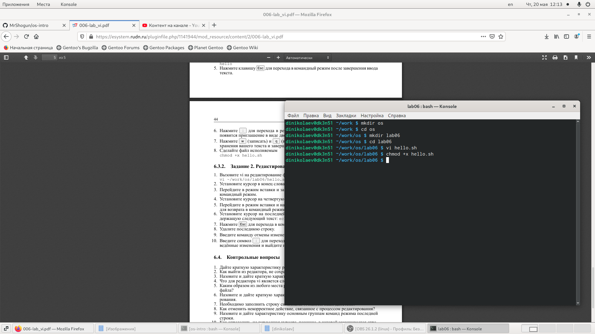

---
# Front matter
lang: ru-RU
title: "Отчёта по лабораторной работе №9"
subtitle: "Текстовый редактор vi"
author: "Николаев Дмитрий Иванович"

# Formatting
toc-title: "Содержание"
toc: true # Table of contents
toc_depth: 2
fontsize: 12pt
linestretch: 1.5
papersize: a4paper
documentclass: scrreprt
polyglossia-lang: russian
polyglossia-otherlangs: english
mainfont: PT Serif
romanfont: PT Serif
sansfont: PT Sans
monofont: PT Mono
mainfontoptions: Ligatures=TeX
romanfontoptions: Ligatures=TeX
sansfontoptions: Ligatures=TeX,Scale=MatchLowercase
monofontoptions: Scale=MatchLowercase
indent: true
pdf-engine: lualatex
header-includes:
  - \linepenalty=10 # the penalty added to the badness of each line within a paragraph (no associated penalty node) Increasing the value makes tex try to have fewer lines in the paragraph.
  - \interlinepenalty=0 # value of the penalty (node) added after each line of a paragraph.
  - \hyphenpenalty=50 # the penalty for line breaking at an automatically inserted hyphen
  - \exhyphenpenalty=50 # the penalty for line breaking at an explicit hyphen
  - \binoppenalty=700 # the penalty for breaking a line at a binary operator
  - \relpenalty=500 # the penalty for breaking a line at a relation
  - \clubpenalty=150 # extra penalty for breaking after first line of a paragraph
  - \widowpenalty=150 # extra penalty for breaking before last line of a paragraph
  - \displaywidowpenalty=50 # extra penalty for breaking before last line before a display math
  - \brokenpenalty=100 # extra penalty for page breaking after a hyphenated line
  - \predisplaypenalty=10000 # penalty for breaking before a display
  - \postdisplaypenalty=0 # penalty for breaking after a display
  - \floatingpenalty = 20000 # penalty for splitting an insertion (can only be split footnote in standard LaTeX)
  - \raggedbottom # or \flushbottom
  - \usepackage{float} # keep figures where there are in the text
  - \floatplacement{figure}{H} # keep figures where there are in the text
---

# Цель работы

Познакомиться с операционной системой Linux. Получить практические навыки работы с редактором vi, установленным по умолчанию практически во всех дистрибутивах.

# Выполнение лабораторной работы

## Первая часть. Создание нового файла с использованием vi

1) Создал каталог ~/work/os/lab06.
2) Перешёл в созданный каталог.
3) Вызвал vi и создал файл hello.sh

4) Включив режим вставки в vi ввёл следующий текст:

5) С помощью клавиши esc вернулся в командный режим.
6) Нажав ":" перешёл в режим последней строки. После нажав "w" (записать) и "q" (выйти), а затем нажав Enter, сохранил текст и завершил работу в редакторе.
7) Сделал файл hello.sh исполняемым (Скриншот 1).

## Вторая часть. Редактирование существующего файла

1) Вызвал vi для редактирования файла ~/work/os/lab06/hello.sh.
2) Установил курсор в конец слова HELL и, перейдя в режим вставки, заменил его на HELLO. Вернулся в командный режим (Esc).
3) Установил курсор на четвёртую строку и стёр слово LOCAL ("d+w") и, перейдя в режим вставки ввёл local. Вернулся в командный режим.
4) Установил курсор на последнюю строку файла, вставил после неё строку, содержащую текст: echo $HELLO. Вернулся в командный режим.
5) Удалил последнюю строку ("d+d").
6) Ввёл команды для отмены изменений ("u") в командном режиме для отмены последней команды.
7) Ввёл символ ":" для перехода в режим последней строки. Записал произведённые изменения и вышел из vi (":+w+q").

## Контрольные вопросы

1. Основными режимами работы можно выделить 3 из них: командный режим необходим для ввода команд редактирования файла и перемещения по нему же; режим вставки нужен для ввода содержания редактируемого файла; режим последней строки позволяет копировать и перемещать текст, записывать файл и выходить из редактора, а также настраивать рабочую среду.
2. Набрать символ "q" ("q!").
3. "0" - переход в начало строки. "$" - переход в конец строки. "G" - переход в конец файла. "n+G" - переход на строку с номером n.
4. Слово - строка символов из букв, цифр и символов подчеркивания.
5. Воспользоваться командой "n+b", взяв n большим (использовать "G") для перехода в начало (конец) файла.
6. Вставка текста - позволяет вставить текст в некотором месте; вставка строки - позволяет вставить строку в зависимости от положения курсора; удаление текста - позволяет удалить символ, слово , строку или текст в зависимости от положения курсора; отмена и повтор произведённых изменений; копирование текста в буфер - копирует строку(и) или слово в буфер; вставка текста из буфера - вставляет текст в зависимости от положения курсора; замена текста - позволяет заменить слова, часть строки или текст; поиск текста - позволяет произвети поиск по тексту указанной строки.
7. Написать "$", скопировать с помощью "Y" и вставить с помощью "n+i".
8. Использовать команду "u" для отмены последнего изменения.
9. Копирование и перемещение текста - позволяет удалять, перемещать, копировать и записывать в файл промежутки строк; запись в файл и выход из редактора - позволяет записывать изменённый текст, выходить из редактора vi, а также возвращаться в командный режим, отменив все изменения с последней записи; опции - позволяет вывести полный список опций, номера строк, невидимые символы, а также не учитывать в поиске, является ли символ прописным или строчным.
10. Перейти в конец строки с помощью "$".
11. 
    - set - показывает значения опций, отличающихся от настроенных по умолчанию.
    - set all - показывает значение всех опций, кромер терминальных.
    - set termcap - показывает значение терминальных опций (в графическом интерфейсе изменение их кодов не приводит к полезным изменениям).
    - set <опция>? - показать значение определённой опции.
    - set <опция> - включить некторую опцию.
    - set no <опция> - отключить некторую опцию.
12. При запуске редактора, вы оказываетесь в командном режиме, что в редакторе не отмечается. При переходе в какой-либо (режим вставки различными командами) другой режим в левом нижнем углу отображается название данного режима, возвращение к командному режиму осуществляется с помощью команды Esc.
13. Граф взаимосвязи режимов работы редактора vi.

[interconnection_graph](image/CQ_13_graph.png)

# Выводы

> Глубже ознакомился с системой Linux. Получил практические навыки для работы с редактором vi, который установлен в большинстве дистрибутивов.
