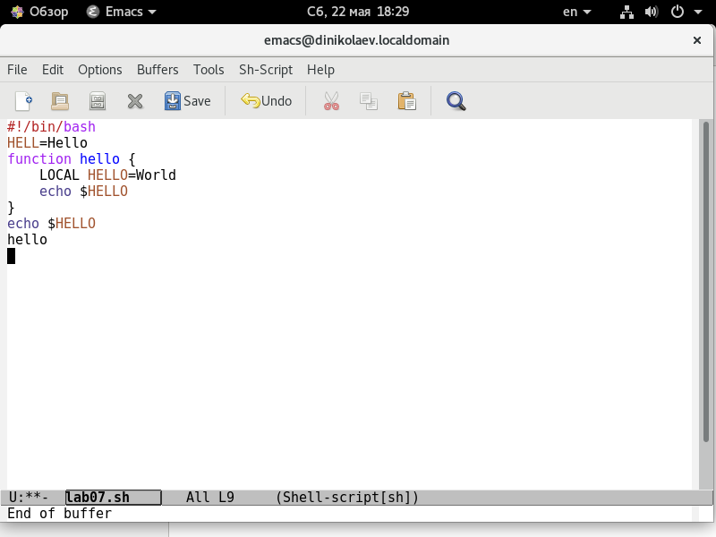
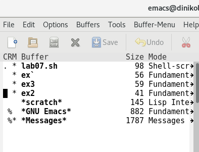
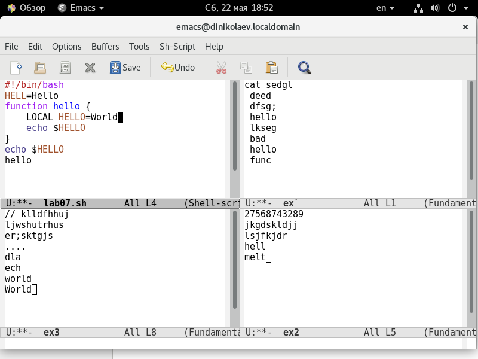
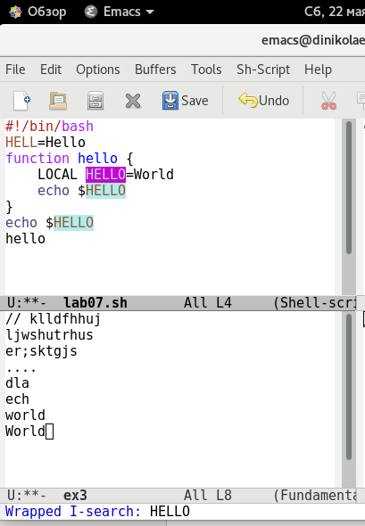
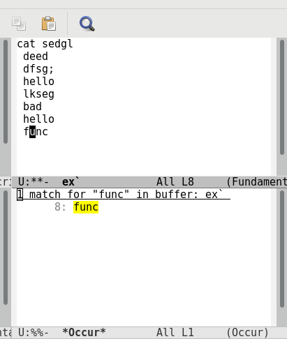

---
# Front matter
lang: ru-RU
title: "Отчёт по лабораторной работе №10"
subtitle: "Текстовой редактор emacs"
author: "Николаев Дмитрий Иванович"

# Formatting
toc-title: "Содержание"
toc: true # Table of contents
toc_depth: 2
fontsize: 12pt
linestretch: 1.5
papersize: a4paper
documentclass: scrreprt
polyglossia-lang: russian
polyglossia-otherlangs: english
mainfont: PT Serif
romanfont: PT Serif
sansfont: PT Sans
monofont: PT Mono
mainfontoptions: Ligatures=TeX
romanfontoptions: Ligatures=TeX
sansfontoptions: Ligatures=TeX,Scale=MatchLowercase
monofontoptions: Scale=MatchLowercase
indent: true
pdf-engine: lualatex
header-includes:
  - \linepenalty=10 # the penalty added to the badness of each line within a paragraph (no associated penalty node) Increasing the value makes tex try to have fewer lines in the paragraph.
  - \interlinepenalty=0 # value of the penalty (node) added after each line of a paragraph.
  - \hyphenpenalty=50 # the penalty for line breaking at an automatically inserted hyphen
  - \exhyphenpenalty=50 # the penalty for line breaking at an explicit hyphen
  - \binoppenalty=700 # the penalty for breaking a line at a binary operator
  - \relpenalty=500 # the penalty for breaking a line at a relation
  - \clubpenalty=150 # extra penalty for breaking after first line of a paragraph
  - \widowpenalty=150 # extra penalty for breaking before last line of a paragraph
  - \displaywidowpenalty=50 # extra penalty for breaking before last line before a display math
  - \brokenpenalty=100 # extra penalty for page breaking after a hyphenated line
  - \predisplaypenalty=10000 # penalty for breaking before a display
  - \postdisplaypenalty=0 # penalty for breaking after a display
  - \floatingpenalty = 20000 # penalty for splitting an insertion (can only be split footnote in standard LaTeX)
  - \raggedbottom # or \flushbottom
  - \usepackage{float} # keep figures where there are in the text
  - \floatplacement{figure}{H} # keep figures where there are in the text
---

# Цель работы

Познакомиться с операционной системой Linux. Получить практические навыки работы с редактором Emacs.

# Термины

- Буфер - объект, представляющий какой-либо текст.
- Фрейм - окно в обычном понимании этого слова, содержащее область вывода и одно или несколько окон Emacs.
- Окно - прямоугольная область фрейма, отображающая один из буферов.
- Область вывода - одна или несколько строк внизу фрейма, где Emacs выводит различные сообщения и запрашивает подтверждения и дополнительную информацию от пользователя.
- Минибуфер - место, использующееся для ввода дополнительной информации и всегда отображается в области вывода.

# Выполнение лабораторной работы

1) Открыл emacs.
2) Создал файл lab07.sh комбинацией клавиш "ctrl+x" "ctrl+f".
3) Набрал текст:

 - Набранный текст в emacs

4) Сохранил файл комбинацией клавиш "ctrl+x" "ctrl+s".
5) Проделал с текстом стандартные процедуры редактирования с помощью разных комбинаций клавиш:

    1. Вырезал одной командой строку командой "ctrl+k" (C-k).
    2. Вставил эту строку в конец файла командой "ctrl+y" (C-y).
    3. Выделил некоторую область текста командой "ctrl+space" (C-space).
    4. Скопировал эту область в буфер обмена командой "alt+w" (M-w).
    5. Вставил скопированную область в конец файла командой "ctrl+y" (C-y).
    6. Вновь выделил эту область ("ctrl+space") и вырезал её командой "ctrl+w" (C-w).
    7. Отменил последнее действие командой "ctrl+/" (C-/).

6) Использовал команды по перемещению курсора:

    1. Переместил курсор в начало строки командой "ctrl+a" (C-a).
    2. Переместил курсор в конец строки командой "ctrl+e" (C-e).
    3. Переместил курсор в начало буфера командой "alt+<" (M-<).
    4. Переместил курсор в конец буфера командой "alt+>" (M->).

7) Использовал возможности emacs для управления буферами:

    1. Вывел список активных буферов на экран (Скриншот 2) командой "ctrl+x" "ctrl+b" (C-x C-b).
    2. Переместился во вновь открытое окно со списком открытых буферов и переключился ко какой-либо другой буфер командой "ctrl+x" "o" (C-x o).
    3. Закрыл это окно командой "ctrl+x" "0" (C-x 0).
    4. Переключился между буферами, не выводя их список на экран, командой "ctrl+x" "b" (C-x b).

 - Список активных буферов

8) Использовал возможности emacs для управления окнами:

    1. Поделил фрейм на 4 части: разделил на 2 окна по вертикали командой "ctrl+x" "3" (C-x 3), а после разделил каждое из окон по горизонтали командой "ctrl+x" "2" (C-x 2).
    2. В каждом из 4-ёх созданных окон открыл новый буфер и ввёл несколько строк текста.

 - фрейм, разделённый на 4 окна.

9) Проверил режим(ы) поиска:

    1. Переключился в режим поиска командой "ctrl+s" (C-s) и нашёл несколько слов, присутствующих в тексте (а текущем файле).
    2. Переключаюсь между результатами поиска командой "ctrl+s" (C-s). (Скриншот 4)
    3. Вышел из режима поиска командой "ctrl+g" (C-g).
    4. Перешёл в режим поиска и замены командой "alt+%" (M-%), ввёл искомый текст, нажал "Enter", а после ввёл текст для замены. Нажал "!" дял подтверждения замены.
    5. Проверил другой режим поиска, вызываемой командой "alt+s" "o" (M-s o). Отличие в том, что обычный режим ищёт совпадения уже по одному и так далее символов, а этот только после конечного ввода искомого текста. (Скриншот 5)

 - результат поиска слова hello с выделенным одним из них

 - результат поиска слова func с помощью альтернативного поиска

## Контрольные вопросы

1. Emacs - мощный экранный редактор текста с массой возможностей, который можно считать средой программирования с большими возможностями редактирования текста (Emacs содержит массу встроенных функций по компиляции и поиску ошибоу в коде).
2. Большая часть функций осуществялется командами, которые новичок априори знать не может, что делает его сложным для новичков.
3. Буфер - некторый текст файла в emacs. Окно - прямоугольная область, содержащая текст файла в emacs, над которой производятся действия.
4. Да, можно.
5. По умолчанию при запуске emacs создаётся 3 буфера: GNU Emacs, scratch, Messages. (А после созданный после запуска файл или изначально включенный)
6. С-с | = "ctrl+c" "|". C-c C-| = "ctrl+c" "ctrl+|".
7. Можно разделить окно по вертикали командой "ctrl+x" "3" (C-x 3) или по горизонтали командой "ctrl+x" "2" (C-x 2).
8. Настройки emacs хранятся в файле .emacs, который хранится в домашней директории пользователя (есть папка .emacs.d, где хранятся дополнительные файлы настроек).
9. Клавиша backspace используется для удаления последствий последней нажатой команды в окне минибуфера (также для простого удаления символов текста в окне редактируемого файла). Клавишу можно переназначить.
10. Для меня удобнее редактор vi, так как я являюсь новичком в обоих редакторах, а редактор vi более интуитивно понятен (многие команды можно заменить более простой комбинацией действий), нежели emacs, в котором схожие изменения произвести тяжелее.

# Выводы

> Глубже ознакомился с системой Linux. получил практические навыки для работы с редактором emacs.
