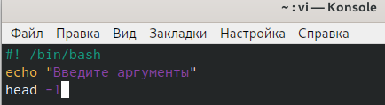
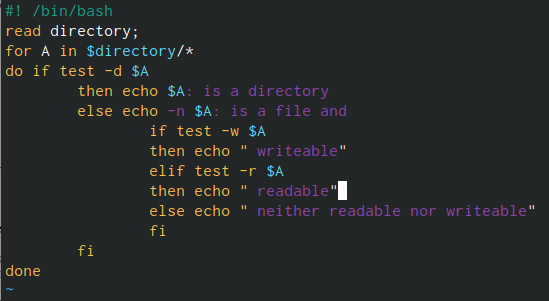
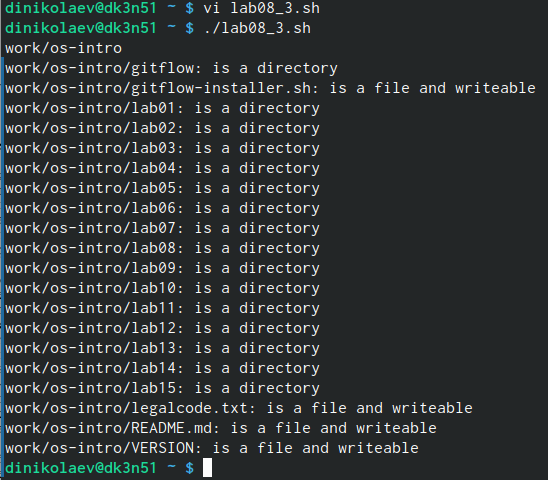
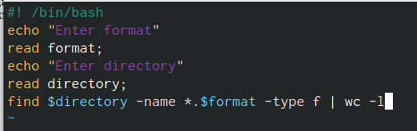

---
# Front matter
lang: ru-RU
title: "Отчёт по лабораторной работе №11"
subtitle: "Программирование в командном процессоре ОС UNIX. Командные файлы"
author: "Николаев Дмитрий Иванович"

# Formatting
toc-title: "Содержание"
toc: true # Table of contents
toc_depth: 2
fontsize: 12pt
linestretch: 1.5
papersize: a4paper
documentclass: scrreprt
polyglossia-lang: russian
polyglossia-otherlangs: english
mainfont: PT Serif
romanfont: PT Serif
sansfont: PT Sans
monofont: PT Mono
mainfontoptions: Ligatures=TeX
romanfontoptions: Ligatures=TeX
sansfontoptions: Ligatures=TeX,Scale=MatchLowercase
monofontoptions: Scale=MatchLowercase
indent: true
pdf-engine: lualatex
header-includes:
  - \linepenalty=10 # the penalty added to the badness of each line within a paragraph (no associated penalty node) Increasing the value makes tex try to have fewer lines in the paragraph.
  - \interlinepenalty=0 # value of the penalty (node) added after each line of a paragraph.
  - \hyphenpenalty=50 # the penalty for line breaking at an automatically inserted hyphen
  - \exhyphenpenalty=50 # the penalty for line breaking at an explicit hyphen
  - \binoppenalty=700 # the penalty for breaking a line at a binary operator
  - \relpenalty=500 # the penalty for breaking a line at a relation
  - \clubpenalty=150 # extra penalty for breaking after first line of a paragraph
  - \widowpenalty=150 # extra penalty for breaking before last line of a paragraph
  - \displaywidowpenalty=50 # extra penalty for breaking before last line before a display math
  - \brokenpenalty=100 # extra penalty for page breaking after a hyphenated line
  - \predisplaypenalty=10000 # penalty for breaking before a display
  - \postdisplaypenalty=0 # penalty for breaking after a display
  - \floatingpenalty = 20000 # penalty for splitting an insertion (can only be split footnote in standard LaTeX)
  - \raggedbottom # or \flushbottom
  - \usepackage{float} # keep figures where there are in the text
  - \floatplacement{figure}{H} # keep figures where there are in the text
---

# Цель работы

Изучить основы программирования в оболочке ОС UNIX/Linux. Научиться писать небольшие командные файлы.

# Выполнение лабораторной работы

1) Написал скрипт, создающий резервную копию самого себя в диреторию backup, находящуюся в домашнем каталоге. Воспользовался архиватором tar, предварительно посмотрев по нему справку с помощью команды "man tar" и создав сам файл (также дав ему право на выполнение "chmod +x") и директорию.

 - Написанный скрипт создания резервной копии (в редакторе vi)

 - Результат выполнения скрипта

2) Написал командный файл (предварительно его создав и дав права на исполнение), который обрабатывает любое число аргументов командной строки, также превышающее десять (использовал head для просмотра верхней строки).

 - Написанный командный файл обработки аргумента (распечатывание)

 - Результат выполнения командного файла

3) Написал командный файл (предварительно создав и дав права на исполнение), который выдаёт информацию о вводимом каталоге и выводит информацию о правах доступа к файлам введённого каталога.

 - Написанный командный файл - аналог команды ls

 - Результат выполнения командного файла

4) Написал командный файл (предварительно создав и дав права на исполнение), который получая на ввод формат файла и путь к указанной директории, выдает количество файлов заданного формата в данной директории.

 - Написанный командный файл подсчёта файлов указанного формата

 - Результат выполнения командного файла

## Контрольные вопросы

1. Командный процессор (командная оболочка, интерпретатор команд shell)—это программа, позволяющая пользователю взаимодействовать с операционной системой компьютера. В операционных системах типа UNIX/Linux наиболее часто используются следующие реализации командных оболочек:

    – Оболочка  Борна  (Bourne  shell  или  sh) — стандартная командная оболочка UNIX/Linux, содержащая базовый, но при этом полный набор функций;
    – С-оболочка  (или  csh) — надстройка на оболочкой Борна, использующая С-подобный синтаксис команд с возможностью сохранения истории выполнения команд;
    – Оболочка Корна (или ksh) — напоминает оболочку С, но операторы управления программой совместимы с операторами оболочки Борна;
    – BASH — сокращение от Bourne Again Shell (опять оболочка Борна), в основе своей совмещает свойства оболочек С и Корна (разработка компании Free Software Foundation).

2. POSIX (Portable Operating System Interface for Computer Environments) — набор стандартов описания интерфейсов взаимодействия операционной системы и прикладных программ.
3. Командный процессор bash обеспечивает возможность использования переменных типа строка символов. Имена переменных могут быть выбраны пользователем. Пользователь имеет возможность присвоить переменной значение некоторой строки символов. Например, команда "mark=/usr/andy/bin" присваивает значение строки символов /usr/andy/bin переменной mark типа строка символов. Значение, присвоенное некоторой переменной, может быть впоследствии использовано. Для этого в соответствующем месте командной строки должно быть употреблено имя этой переменной, которому предшествует метасимвол $. Например, команда "mv afile ${mark}" переместит файл afile из текущего каталога в каталог с абсолютным полным именем /usr/andy/bin. Оболочка bash позволяет также работать с массивами. Для создания массива используется команда set с флагом "-A". За флагом следует имя переменной, а затем список значений, разделённых пробелами. Например, "set -A states Delaware Michigan "New Jersey"".
4. Оболочка bash поддерживает встроенные арифметические функции. Команда let является показателем того, что последующие аргументы представляют собой выражение, подлежащее вычислению. Простейшее выражение — это единичный терм (term), обычно целочисленный. Команда let берет два операнда и присваивает их переменной. Вы можете писать команды типа "let sum=x+7", и let будет искать переменную и добавлять к ней 7. Команда let также расширяет другие выражения let, если они заключены в двойные круглые скобки ("(())"). Таким способом можно создавать довольно сложные выражения. Команда let не ограничена простыми арифметическими выражениями. Команда read позволяет читать значения переменных со стандартного ввода: "echo "Please enter Month and Day of Birth ?""    "read mon day trash". В переменные mon и day будут считаны соответствующие значения, введённые с клавиатуры, а переменная trash нужна для того, чтобы отобрать всю избыточно введённую информацию и игнорировать её.
5. Используются классические операции простейшей математики (сложение, вычитание, умножение и т.д.), операции алгебры логики, операции сравнения, а также разлчные сдвиги.
6. Для облегчения программирования можно записывать условия оболочки bash в двойные скобки — (( )). Можно присваивать результаты условных выражений переменным, также как и использовать результаты арифметических вычислений в качестве условий.
7. Некоторые стандартные переменные:

    –HOME — имя домашнего каталога пользователя. Если команда cd вводится без аргументов, то происходит переход в каталог, указанный в этой переменной.
    –IFS — последовательность символов, являющихся разделителями в командной строке, например, пробел, табуляция и перевод строки (new line).
    –MAIL — командный процессор каждый раз перед выводом на экран промптера проверяет содержимое файла, имя которого указано в этой переменной, и если содержимое этого файла изменилось с момента последнего ввода из него, то перед тем как вывести на терминал промптер, командный процессор выводит на терминал сообщение "You have mail" (у Вас есть почта).
    –TERM — тип используемого терминала.
    –LOGNAME — содержит регистрационное имя пользователя, которое устанавливается автоматически при входе в систему.

8. Такие символы, как "'", "< >", "*", "?",  "|",  "\",  """,  "&", являются метасимволами и имеют для командного процессора специальный смысл.
9. Снятие специального смысла с метасимвола называется экранированием метасимвола. Экранирование может быть осуществлено с помощью предшествующего метасимволу символа "\", который, в свою очередь, является метасимволом. Для экранирования группы метасимволов нужно заключить её в одинарные кавычки. Строка, заключённая в двойные кавычки, экранирует все метасимволы, кроме "$", "'", "\", """.
10. Последовательность команд может быть помещена в текстовый файл. Такой файл называется командным. Далее этот файл можно выполнить по команде: "bash <командный_файл> [аргументы]". Чтобы не вводить каждый раз последовательности символов bash, необходимо изменить код защиты этого командного файла, обеспечив доступ к выполнению.
11. Группу команд можно объединить в функцию. Для этого существует ключевое слово function, после которого следует имя функции и список команд, заключённых в фигурные скобки.
12. Ввести в командной строке "ls -l" и в правах доступа посмотреть есть ли буква d в самом начале, если есть, то это каталог, если нет - файл.
13. Команда set используется для создания объектов (например массивов с флагом -A). Команда unset позволяет удалять объекты (например функции с флагом -f). Команда typeset позволяет перечислять определённые функции, инициировать трассировку функции, экспортировать функции в дочерние программы оболочек, а также обозначать функции как автоматически загружаемые.
14. Символ "$" является метасимволом командного процессора. Он используется, в частности, для ссылки на параметры, точнее, для получения их значений в командном файле. В командный файл можно передать до девяти параметров.
15. Некоторые специальные переменные:

 - Ответ на 15 вопрос

# Выводы

> Изучил основы программирования в оболочке ОС UNIX/Linux, а также научился писать различные командные файлы. Освоил некоторые базовые команды оболочки bash.