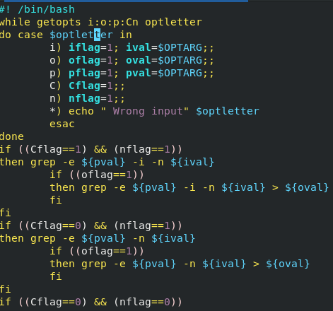
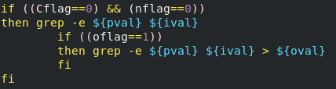
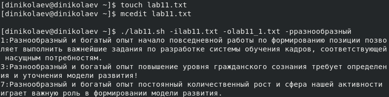
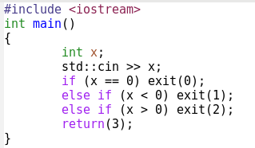
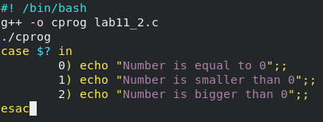
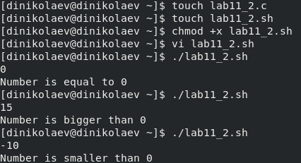
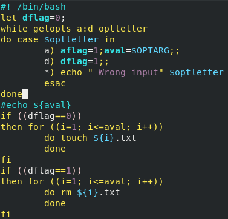
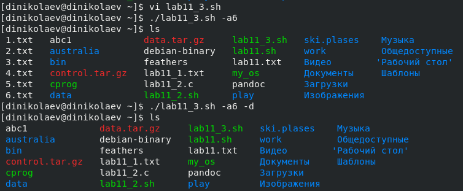
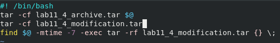
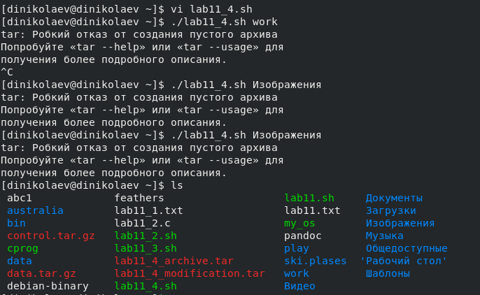

---
# Front matter
lang: ru-RU
title: "Отчёт по лабораторной работе №12"
subtitle: "Программирование в командном процессоре ОС UNIX. Ветвления и циклы"
author: "Николаев Дмитрий Иванович"

# Formatting
toc-title: "Содержание"
toc: true # Table of contents
toc_depth: 2
fontsize: 12pt
linestretch: 1.5
papersize: a4paper
documentclass: scrreprt
polyglossia-lang: russian
polyglossia-otherlangs: english
mainfont: PT Serif
romanfont: PT Serif
sansfont: PT Sans
monofont: PT Mono
mainfontoptions: Ligatures=TeX
romanfontoptions: Ligatures=TeX
sansfontoptions: Ligatures=TeX,Scale=MatchLowercase
monofontoptions: Scale=MatchLowercase
indent: true
pdf-engine: lualatex
header-includes:
  - \linepenalty=10 # the penalty added to the badness of each line within a paragraph (no associated penalty node) Increasing the value makes tex try to have fewer lines in the paragraph.
  - \interlinepenalty=0 # value of the penalty (node) added after each line of a paragraph.
  - \hyphenpenalty=50 # the penalty for line breaking at an automatically inserted hyphen
  - \exhyphenpenalty=50 # the penalty for line breaking at an explicit hyphen
  - \binoppenalty=700 # the penalty for breaking a line at a binary operator
  - \relpenalty=500 # the penalty for breaking a line at a relation
  - \clubpenalty=150 # extra penalty for breaking after first line of a paragraph
  - \widowpenalty=150 # extra penalty for breaking before last line of a paragraph
  - \displaywidowpenalty=50 # extra penalty for breaking before last line before a display math
  - \brokenpenalty=100 # extra penalty for page breaking after a hyphenated line
  - \predisplaypenalty=10000 # penalty for breaking before a display
  - \postdisplaypenalty=0 # penalty for breaking after a display
  - \floatingpenalty = 20000 # penalty for splitting an insertion (can only be split footnote in standard LaTeX)
  - \raggedbottom # or \flushbottom
  - \usepackage{float} # keep figures where there are in the text
  - \floatplacement{figure}{H} # keep figures where there are in the text
---

# Цель работы

Изучить основы программирования в оболочке ОС UNIX. Научится писать более сложные командные файлы с использованием логических управляющих конструкций и циклов.

# Выполнение лабораторной работы

1) Написал командный файл, анализирующий командную строку вместе с ключами (на примере случайного текста).

 - Командный файл, анализирующий строку вместе с ключами

 - Продолжение этого командного файла

 - Результат выполнения командного файла на примере случайно сгенерированного текста

2) Написал на языке C++ программу, которая производит сравнение введённого числа относительно нуля, а командный файл должен вызывать эту программу и выдать сообщение о введённом.

 - Программа сравнения числа с нулём на C++

 - Командный файл, вызывающий программу и выводящий сообщение о введённом

 - Результат выполнения командного файла

3) Написал командный файл, создающий указанное число пронумерованных файлов, а также способный удалять созданные им файлы (если они существуют).

 - Командный файл, создающий несколько пронумерованных файлов (и удаляющий их с другим флагом)

 - Результат выполнения командного файла (и удаление с флагом -d)

4) Написал командный файл, запаковывающий в архив с помощью команды tar все файлы указанной директории. И написал его модификацию для запаковывания только тех файлов, что были изменены менее недели назад с помощью команды find (модификация - последняя строка командного файла).

 - Командный файл, архивирующий введённый каталог (модификация - последняя строка)

 - Результат выполнения командного файла на примере каталогов work и Изображения

## Контрольные вопросы

1. getopts - встроенная команда оболочки bash, предназначенной для разбора параметров сценариев. Обрабатываются только однобуквенные параметры.
2. При генерации имён применяются следующие метасимволы:

    - "*" - соответствует произвольной, в том числе и пустой строке;
    - "?" - соответствует одному любому символу;
    - "[c1-c2]" - соответствует любому символу между символами c1 и c2.
3. Операторы ";" (последовательное выполнение команд), "&&" (выполнение только после успешного выполнения предыдущей), "||" (выполнение только после ошибочного выполнения предыдущей). А также условные операторы (case, for, if, while).
4. Для прерывания используется оператор break для прерывания выполнения ближайшего включающего цикла или условного оператора и команда continue, которая завершает данную итерацию цикла.
5. Команда true возвращает ноль на выходе, что обозначает успешное выполнение. Команда false возвращает не ноль (часто 1), что обозначает неудачу. (Другими словами 0 - истина, другое значение - ложь).
6. Данная строка означает условие существования файла man$s/$i.$s, где $ - означает какой-либо один символ.
7. Цикл while выполняется пока указанное условие истинно (когда ложно, то цикл завершается), а until выполняется пока условие ложно.

# Выводы

> Изучил основы программирования в оболочке ОС UNIX, освоил написание более сложных командных файлов, используя ещё логические управляющие конструкции и циклы.