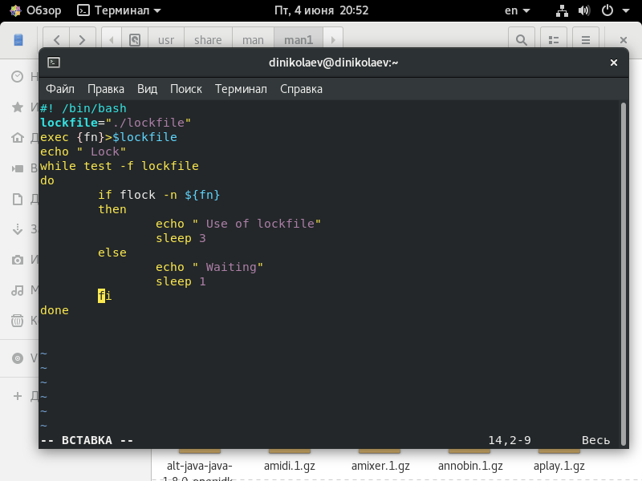
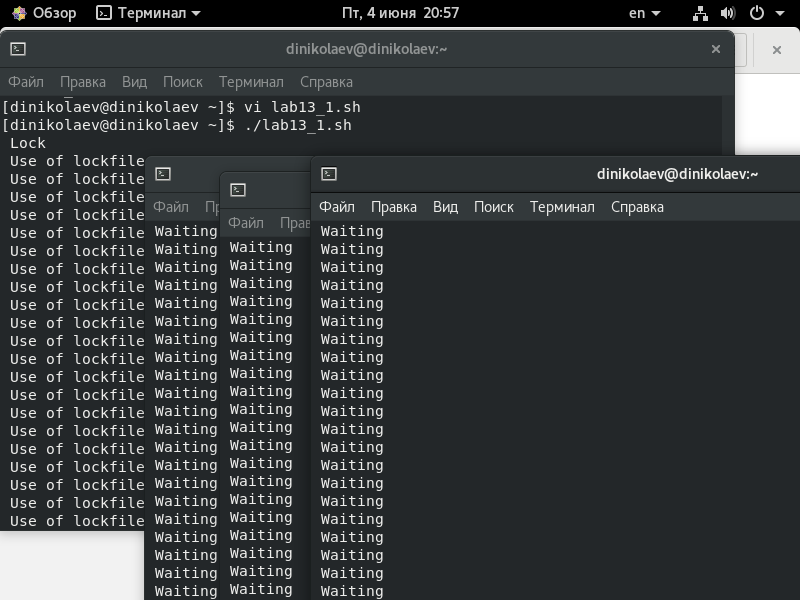
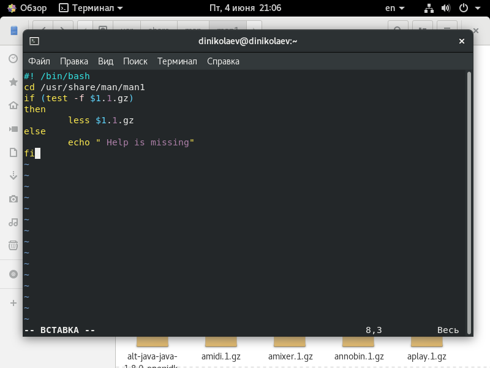
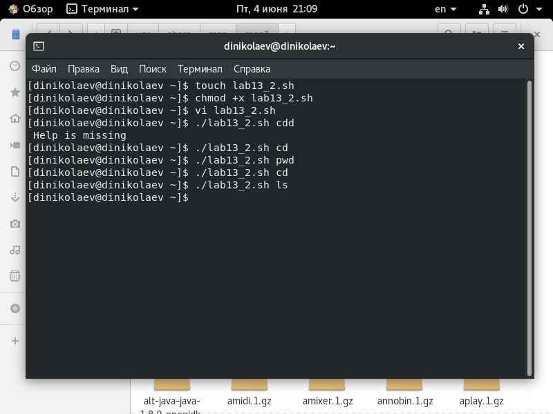
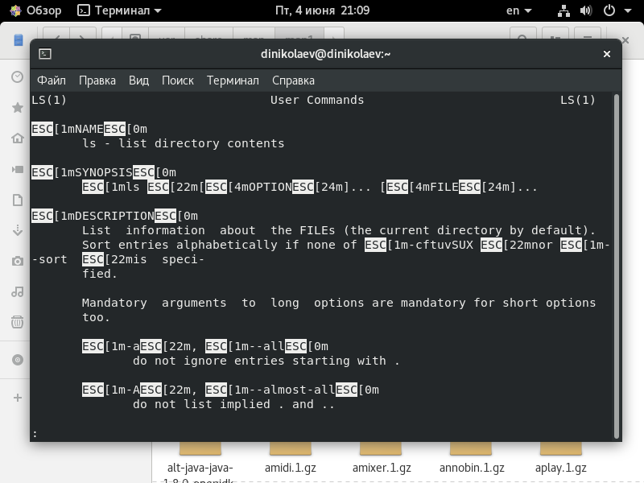
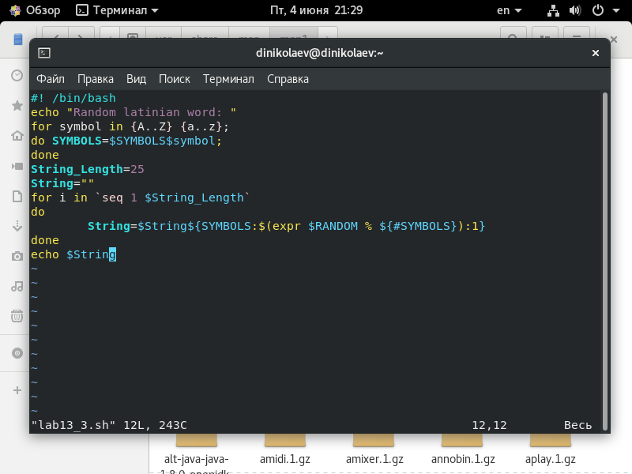
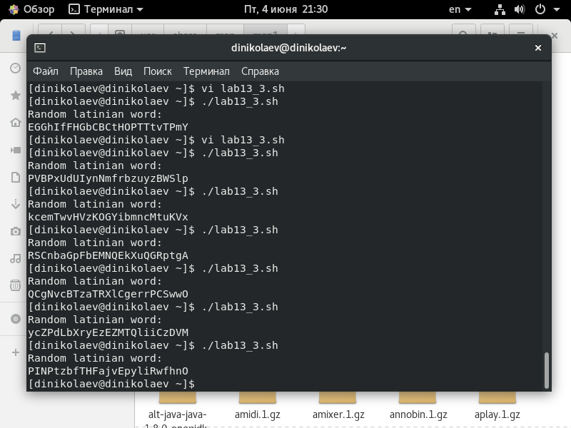

---
# Front matter
lang: ru-RU
title: "Отчёт по лабораторной работе №13"
subtitle: "Программирование в командном процессоре ОС UNIX. Расширенное программирование"
author: "Николаев Дмитрий Иванович"

# Formatting
toc-title: "Содержание"
toc: true # Table of contents
toc_depth: 2
fontsize: 12pt
linestretch: 1.5
papersize: a4paper
documentclass: scrreprt
polyglossia-lang: russian
polyglossia-otherlangs: english
mainfont: PT Serif
romanfont: PT Serif
sansfont: PT Sans
monofont: PT Mono
mainfontoptions: Ligatures=TeX
romanfontoptions: Ligatures=TeX
sansfontoptions: Ligatures=TeX,Scale=MatchLowercase
monofontoptions: Scale=MatchLowercase
indent: true
pdf-engine: lualatex
header-includes:
  - \linepenalty=10 # the penalty added to the badness of each line within a paragraph (no associated penalty node) Increasing the value makes tex try to have fewer lines in the paragraph.
  - \interlinepenalty=0 # value of the penalty (node) added after each line of a paragraph.
  - \hyphenpenalty=50 # the penalty for line breaking at an automatically inserted hyphen
  - \exhyphenpenalty=50 # the penalty for line breaking at an explicit hyphen
  - \binoppenalty=700 # the penalty for breaking a line at a binary operator
  - \relpenalty=500 # the penalty for breaking a line at a relation
  - \clubpenalty=150 # extra penalty for breaking after first line of a paragraph
  - \widowpenalty=150 # extra penalty for breaking before last line of a paragraph
  - \displaywidowpenalty=50 # extra penalty for breaking before last line before a display math
  - \brokenpenalty=100 # extra penalty for page breaking after a hyphenated line
  - \predisplaypenalty=10000 # penalty for breaking before a display
  - \postdisplaypenalty=0 # penalty for breaking after a display
  - \floatingpenalty = 20000 # penalty for splitting an insertion (can only be split footnote in standard LaTeX)
  - \raggedbottom # or \flushbottom
  - \usepackage{float} # keep figures where there are in the text
  - \floatplacement{figure}{H} # keep figures where there are in the text
---

# Цель работы

Изучить основы программирования в оболочке ОС UNIX. Научиться писать более сложные командные файлы с использованием логических управляющих конструкций и циклов.

# Выполнение лабораторной работы

1) Написал командный файл, который реализует упрощённый механизм семафоров для доступа к необходимому ресурсу.

 - Командый файл, реализующий механизм семафоров

 - Результат использования командного файла

2) Реализовал аналог команды man с помощью командного файла (через каталог /usr/share/man/man1), если введённой команды нет, то файл выводит сообщение об её отсутствии.

 - Командный файл аналог команды man

 - Вывод на несуществующую команду и вызов справки по другим командам

 - Вывод справки по команде ls с помощью командного файла

3) Написал командный файл, создающий строку длиной 25 со случайной последовательностью букв латинского алфавита (Различая заглавные и строчные буквы), при этом используя встроенную переменную $RANDOM.

 - Командный файл, выводящий случайную последовательность латинских букв

 - Вывод командного файла

## Контрольные вопросы

1. В этой строке надо квадратные скобки заменить на круглые ( while ($1 != "exit") ).
2. Можно объединить с помощью знаков ">", "|" или используя подобные выражения "expr3=$expr1$expr2" (Использовалось в командном файле с рандомными числами).
3. Команда "seq" выводит последовательность целых или действительных чисел с указанным шагом, можно использовать с циклом for, подставляя команды.
4. Результатом будет число 3 (дробная часть отбрасывается).
5. В zsh возможно свободно настраивать сочетания клавиш; встроенная команда zmv позволяет массово переименововать файлы или директории; в zsh поддерживаются числа с плавающей точкой; в zsh нумерация начинается с 1.
6. Да, синтаксис этой конструкции верен ("for((a=1;a <= LIMIT;a++))").
7. Перечислим некоторые отличия:

    - Скорость работы программ на ассемблере на 50% медленее оптимизированных на C/C++;
    - Скорость работы виртуальной ява-машины с байт-кодом обычно превосходит скорость аппаратуры с кодами (уступает только ассемблеру и лучшим оптимизирующим трансляторам), получаемыми трансляторами с языков высокого уровня;
    - Скорость компиляции и исполнения программ на яваскрипт в популярных браузерах лишь в 2-3 раза уступает лучшим трансляторам и даже превосходит некоторые качественные компиляторы (намного при этом обгоняя в скорости исполнения программ);
    - Скорость кодов, генерируемых компилятором C оказалась меньшей, чем у GNU;
    - Стек большинства тестируемых языков поддерживает только очень ограниченное число рекурсивных вызовов, некоторые же трансляторы позволяют увеличить размер стека;
    - В версиях gawk, php, perl и bash реализован динамических стек, который позволяет использовать всю ОП компьютера. Но bash использует стек слишком экстенсивно.

# Выводы

> Закрепил основы программирования в оболочке ОС UNIX/Linux, научился писать более сложные командные файлы с использованием логических управляющих конструкций и циклов.