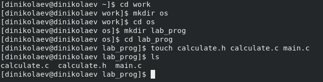

---
# Front matter
lang: ru-RU
title: "Отчёт по лабораторной работе №14"
subtitle: "Средства, применяемые при разработке программного обеспечения в ОС типа UNIX/Linux"
author: "Николаев Дмитрий Иванович"

# Formatting
toc-title: "Содержание"
toc: true # Table of contents
toc_depth: 2
fontsize: 12pt
linestretch: 1.5
papersize: a4paper
documentclass: scrreprt
polyglossia-lang: russian
polyglossia-otherlangs: english
mainfont: PT Serif
romanfont: PT Serif
sansfont: PT Sans
monofont: PT Mono
mainfontoptions: Ligatures=TeX
romanfontoptions: Ligatures=TeX
sansfontoptions: Ligatures=TeX,Scale=MatchLowercase
monofontoptions: Scale=MatchLowercase
indent: true
pdf-engine: lualatex
header-includes:
  - \linepenalty=10 # the penalty added to the badness of each line within a paragraph (no associated penalty node) Increasing the value makes tex try to have fewer lines in the paragraph.
  - \interlinepenalty=0 # value of the penalty (node) added after each line of a paragraph.
  - \hyphenpenalty=50 # the penalty for line breaking at an automatically inserted hyphen
  - \exhyphenpenalty=50 # the penalty for line breaking at an explicit hyphen
  - \binoppenalty=700 # the penalty for breaking a line at a binary operator
  - \relpenalty=500 # the penalty for breaking a line at a relation
  - \clubpenalty=150 # extra penalty for breaking after first line of a paragraph
  - \widowpenalty=150 # extra penalty for breaking before last line of a paragraph
  - \displaywidowpenalty=50 # extra penalty for breaking before last line before a display math
  - \brokenpenalty=100 # extra penalty for page breaking after a hyphenated line
  - \predisplaypenalty=10000 # penalty for breaking before a display
  - \postdisplaypenalty=0 # penalty for breaking after a display
  - \floatingpenalty = 20000 # penalty for splitting an insertion (can only be split footnote in standard LaTeX)
  - \raggedbottom # or \flushbottom
  - \usepackage{float} # keep figures where there are in the text
  - \floatplacement{figure}{H} # keep figures where there are in the text
---

# Цель работы

Приобрести простейшие навыки разработки, анализа, тестирования и отладки приложений в ОС типа UNIX/Linux на примере создания на языке программирования С калькулятора с простейшими функциями.

# Выполнение лабораторной работы

1) Создал в домашнем каталоге подкаталог ~/work/os/lab_prog. А после создал в нём файлы calculate.h, calculate.c, main.c.

 - Создание подкаталога и файлов для калькулятора в нём

2) В файле calculate.c, написанном на C, реализовал функции калькулятора (+,-,*,/,pow,sqrt,sin,cos,tan):

 - Файл calculate.c, реализующий функции калькулятора

3) В файле calculate.h реализовал интерфейс, описывающий формат вызова функции-калькулятора:

 - Интерфейсный файл calculate.h

4) В файле main.c, написанном на C, реализовал интерфейс пользователя к калькулятору:

 - Основной файл main.c, реализующий интерфейс пользователя к калькулятору

5) Выполнил компиляцию программы калькулятора посредством gcc (назвав итоговый файл calcul).

 - Компиляция программы калькулятора

6) Исправил синтаксические ошибки (в "%s, &Operation" знак "&" не нужен).

7) Создал Makefile, реализующий компиляцию программы калькулятора (добавил CFLAGS = -g для дальнейшей отладки gdb).

 - Makefile для компиляции программы калькулятора

8) Снова скомпилировал программу с флагом -g (с помощью make) и выполнил с помощью gdb отладку программы calcul.

 - Запустил отладку программы calcul ("gdb ./calcul")

9) Запустил программу внутри отладчика ("run"), запустил постраничный(по 9 строк) просмотр исходного кода ("list"), запустил просмотр строк с 12 по 15 основного файла ("list 12,15").

 - запуск программы, просмотр с 1 по 9 и с 12 по 15 строки

10) Запустил просмотр строк файл calculate.c с 20 по 29 строки ("list calculate.c:20,29"), Установил точку останова в файле calculate.c на 21-ой строке ("list calculate.c:20,27" "break 21") и вывел информацию об имеющихся точках останова ("info breakpoints").

 - просмотр строк файла calculate.c с 20 по 29 и установка точки останова на 21-ой строке

11) Запустил программу внутри отладчика и убедился в остановке в момент прохождения точки останова, с помощью команды backtrace просмотрел стек вызываемых функций от начала программы до текущего момента, посмотрел значение переменной Numeral ("print Numeral") и сравнил с выводом после команды "display Numeral", убрал точки останова ("delete 1").

 - Запуск программы и проверка значений на точке останова с последующим её удалением

12) Проанализировал коды файлов calculate.c и main.c с помощью утилиты splint.

 - splint main.c

 - splint calculate.c

## Контрольные вопросы

1. С помощью функций info и man.
2. Процесс разработки программного обеспечения обычно разделяется на следующие этапы:

    a.  Планирование, включающее сбор и анализ требований к функционалу и другим характеристикам разрабатываемого приложения;
    b. Проектирование, включающее в себя разработку базовых алгоритмов и спецификаций, определение языка программирования;
    c. Непосредственная разработка приложения:

	– Кодирование — по сути создание исходного текста программы;
	– Анализ разработанного кода;
	– Сборка, компиляция и разработка исполняемого модуля;
	– Тестирование и отладка, сохранение произведённых изменений;
	– Документирование

3. В данном контексте суффикс позволяет определить какая компиляция требуется для программы, он указывает тип объекта. Например по суффиксу ".c" компилятор распознаёт, что файл abc.c должен компилироваться (Язык C), а по суффиксу ".o", что файл abc.o является объектным. Так, для компиляции программы abc.c и построения исполняемого файла abc нужно ввести: "gcc -o abc abc.c".
4. Назначение состоит в компиляции всей программы в целом и получении исполняемого файла.
5. Утилита make освобождает пользователя от различной рутинной работы (например перекомпиляция файлов после внесённых изменений) и служит для документирования взаимосвязей между указанными файлами. Описание этого хранится в специальном make-файле (makefile или Makefile).
6. Подобный пример можно увидеть в основной части работы (п.7, Скриншот 6), где Makefile производит компиляцию файлов calculate.c, main.c (с флагом -g для отладки), создаёт исполняемый файл calcul на основе объектных файлов calculate.o и main.o (с флагом -lm) и позволяет удалить созданный исполняемый файл и объектные файлы.

 - Пример Makefile

7. Практически все отладчики поддерживают возможность пошаговой отладки программы (а также выполнение до курсора и выход из подпрограммы), сделать это можно посредством установки точке останова.
8. Характеристики основных команд отладчика gdb:

    - backtrace - вывод на экран пути к текущей точке останова;
    - break - установка точки останова (аргумент - номер строки или название функции);
    - clear - удаление всех точек останова в функции;
    - continue - продолжение выполнения программы;
    - delete - удаление точки останова;
    - display - добавление выражения в список выражений, значения которых отображаются при достижении точки останова;
    - finish - выполнение программы до момента выхода из функции;
    - info breakpoints - вывод на экран списка используемых точек останова;
    - info watchpoints - вывод на экран списка используемых контрольных выражений;
    - list - вывод на экран исходного кода (аргумент - название файла и через ":" номер начальной и конечной строк);
    - next - выполнение программы пошагово, но без выполнения вызываемых в программе функций;
    - print - вывод значения указываемого в качестве параметра выражения;
    - run - запуск программы на выполнение;
    - set - установка нового значения переменной;
    - step - пошаговое выполнение программы;
    - watch - установка контрольного выражения, при изменении значения которого программа будет остановлена.

9. Схема отладки программы calcul:

    1) Выполнил компиляцию программы (с флагом -g).
    2) Просмотрел ошибки в программе.
    3) Исправил ошибки.
    4) Загрузил программу в отладчике gdb.
    5) Выполнил программу в отладчике ("run").
    6) Ввёл некоторые значения.
    7) Установил точку останова.
    8) Проверил значения на момент остановки.
    9) Программа завершена -> отладчик gdb ошибок не видит.

10. Отладчик указал на неверный формат "%s" для &Operation, "%s" - символьный формат, так что ссылка не нужна ("&"), таким образом нужен только Operation.
11. Помогают понять исходный код программы такие средства как: cscope - исследует функции, содержащиеся в программе; splint - осуществляет критическую проверку программ, которые написаны на языке C.
12. Утилита splint осуществляет такие задачи как:

    a. Проверка корректности задания аргументов всех использованных в программе функций и типов возвращаемых ими значений;
    b. Поиск фрагментов исходного текста, корректных с точки зрения синтаксиса языка C, но малоэффективных с точки зрения их реализации или содержащих в себе семантические ошибки;
    c. Общая оценка мобильности пользовательской программы.

# Вывод

> Приобрёл простейшие навыки разработки, анализа, тестирования и отладки приложений в ОС типа UNIX/Linux на примере создания на языке программирования C калькулятора с простейшими функциями.