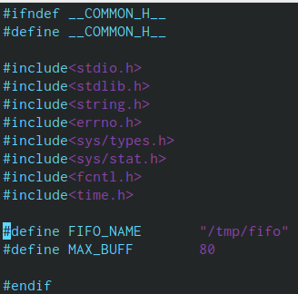
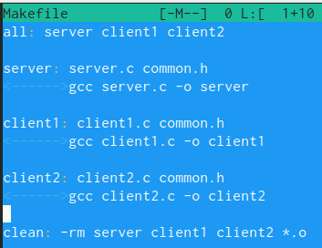

---
# Front matter
lang: ru-RU
title: "Отчёт по лабораторной работе №15"
subtitle: "Именованные каналы"
author: "Николаев Дмитрий Иванович"

# Formatting
toc-title: "Содержание"
toc: true # Table of contents
toc_depth: 2
fontsize: 12pt
linestretch: 1.5
papersize: a4paper
documentclass: scrreprt
polyglossia-lang: russian
polyglossia-otherlangs: english
mainfont: PT Serif
romanfont: PT Serif
sansfont: PT Sans
monofont: PT Mono
mainfontoptions: Ligatures=TeX
romanfontoptions: Ligatures=TeX
sansfontoptions: Ligatures=TeX,Scale=MatchLowercase
monofontoptions: Scale=MatchLowercase
indent: true
pdf-engine: lualatex
header-includes:
  - \linepenalty=10 # the penalty added to the badness of each line within a paragraph (no associated penalty node) Increasing the value makes tex try to have fewer lines in the paragraph.
  - \interlinepenalty=0 # value of the penalty (node) added after each line of a paragraph.
  - \hyphenpenalty=50 # the penalty for line breaking at an automatically inserted hyphen
  - \exhyphenpenalty=50 # the penalty for line breaking at an explicit hyphen
  - \binoppenalty=700 # the penalty for breaking a line at a binary operator
  - \relpenalty=500 # the penalty for breaking a line at a relation
  - \clubpenalty=150 # extra penalty for breaking after first line of a paragraph
  - \widowpenalty=150 # extra penalty for breaking before last line of a paragraph
  - \displaywidowpenalty=50 # extra penalty for breaking before last line before a display math
  - \brokenpenalty=100 # extra penalty for page breaking after a hyphenated line
  - \predisplaypenalty=10000 # penalty for breaking before a display
  - \postdisplaypenalty=0 # penalty for breaking after a display
  - \floatingpenalty = 20000 # penalty for splitting an insertion (can only be split footnote in standard LaTeX)
  - \raggedbottom # or \flushbottom
  - \usepackage{float} # keep figures where there are in the text
  - \floatplacement{figure}{H} # keep figures where there are in the text
---

# Цель работы

Приобретение практических навыков работы с именованными каналами.

# Выполнение лабораторной работы

1) Создал файлы под будущую программу (common.h, server.c client1.c, client2.c, Makefile), позднее переместив их в другую директорию для удобства.

 - Создал файлы для сервера и клиентов

2) Изучил приведённые в тексте программы и взял их за образец, сделав некоторые изменения:

    - В заголовочный файл со стандартными определениями добавил библиотеку time.h

 - Заголовочный файл common.h

    - В программе с сервером изменил условие выхода - поставив ограничение по времени существования сервера.

 - Программа, реализующая сервер

    - В программах с клиентами поставил цикл, для ограничения по времени, где первый клиент останавливает работу на 4 секунды (sleep(4)), а второй - на 5 (sleep(5)).

 - Программа, реализующая первый клиент

 - Программа, реализующая второй клиент

    - В make-файле изменил названия для компилирующихся файлов (сделав аналог для второго клиента), добавив где необходимо файлы, связанные со вторым клиентом.

 - Makefile

3) Таким образом, я написал программы сервера и двух клиентов, где клиенты передают сообщение с разной периодичностью, приостанавливая свою работу, а сервер заканчивает свою работу, выводя при этом время своей работы.

4) С помощью make я скомпилировал программы и запустил их исполняемые файлы на разных консолях (под сервер и два клиента).

 - Результат работы сервера и клиентов на нём

## Контрольные вопросы

1. Именованные файлы имеют идентификатор канала, представленный в специальном файле (неименованные соответственно не имеют идентификатора).
2. Можно с помощью системного вызова pipe (массив из двух целых чисел - выходной параметр).
3. Можно, в основном используя mkfifo.
4. int read(int pipe_fd, void *area, int cnt);
   int write(int pipe_fd, void *area, int cnt);
Где первый аргумент - дескриптор канала, второй - указатель на область памяти, а третий - количество байт памяти.
5. int mkfifo(const char *pathname, mode_t mode);
mkfifo(FIFO_NAME, 0600);
Где первый параметр - имя файла(идентификатор канала), второй - маска прав доступа.
6. При чтении меньшего числа байт, чем находится в канале, возвращается требуемое число байт, остаток сохраняется для следующих чтений, при чтении большего - возвращается доступное число байт.
7. При записи меньшего числа байт, чем это позволяет канал или FIFO, гарантируется атомарность операции, другими словами, если несколько процессов одновременно записывают в канал, порции данных от процессов не перемешиваются, если же производится запись большего числа байт - вызов write(2) блокируется до освобождения места, а атомарность операции не гарантируется.
8. В общем случае это возможно (каждый из взаимодействующих каналов пишет и читает информацию в канал), но традиционной схемой работы с каналом является однонаправленная организация, где канал связывают несколько взаимодействующих процессов, каждый из которых либо читает, либо пишет в канал.
9. Функция write записывает length байт из буфера buffer в файл, определённый дескриптором файла fd. С помощью write можно посылать сообщение клиенту или серверу. Операция является двоичной и без буферизации(1).
10. Strerror - функция языков C/C++, которая транслирует код ошибки, хранящийся в глобльной переменной errno, в сообщение об ошибке. Возвращённый указатель ссылается на статическую строку с ошибкой, не изменённая программой. Дальнейшие вызовы функции strerror перезапишут содержание ошибочной строки. Сообщения об ошибках зависят от платформы или компилятора.

# Выводы

> В результате работы, я приобрёл практические навыки работы с именованными каналами.